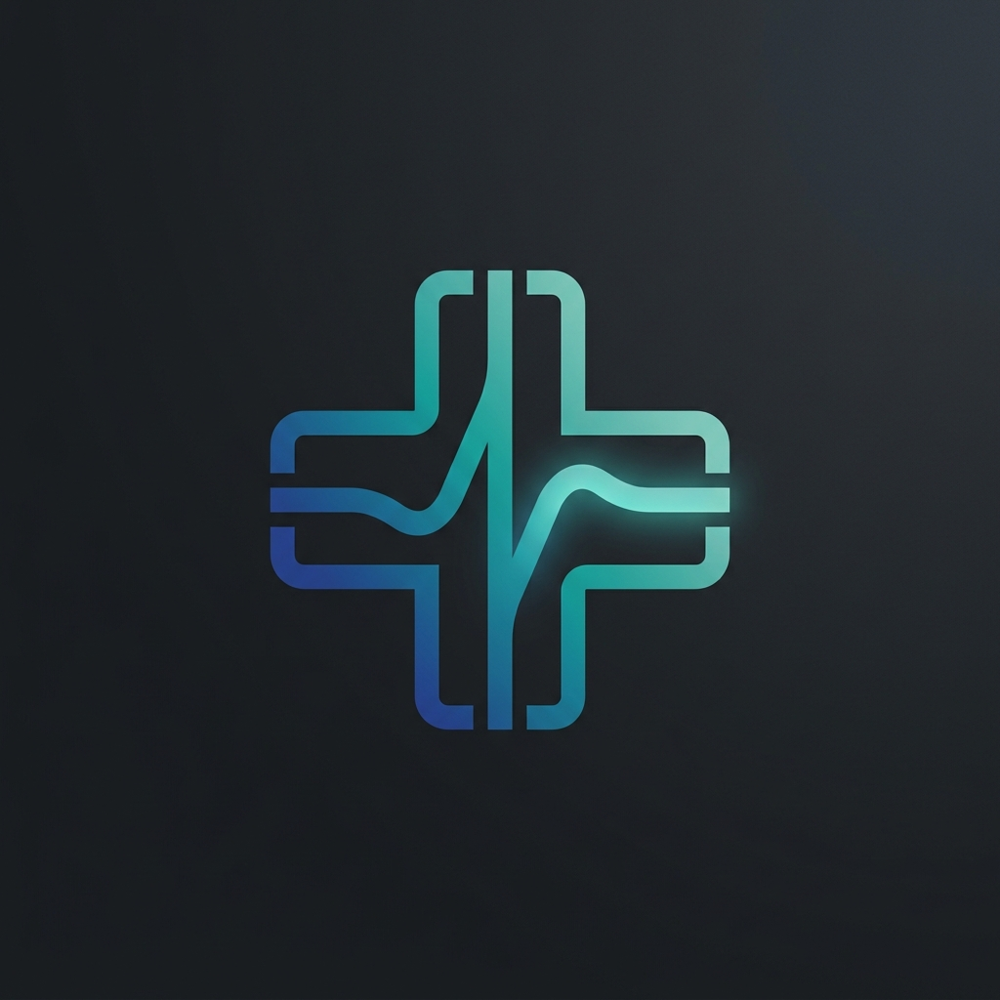

# VetSync Enterprise

<p align="center">
  
</p>

<p align="center">
  <strong>Production-Grade Veterinary Practice & Clinic Management System</strong>
</p>

<p align="center">
  <a href="https://spring.io/projects/spring-boot"></a>
  <a href="https://jdk.java.net/17/"></a>
  <a href="https://www.oracle.com/java/technologies/downloads/"></a>
  <a href="https://kubernetes.io/"></a>
  <a href="LICENSE.txt"></a>
</p>

---

## 📋 Overview

**VetSync Enterprise** is a high-performance, production-ready Veterinary Practice Management System (PMS) built on the modern Spring Boot 4.x framework. Designed for veterinary clinics, hospitals, and multi-location animal care networks, VetSync enables seamless administration of patient histories, pet owner registrations, veterinary schedules, and clinical visit logging.

This project represents an evolution of clinical management systems into a enterprise-grade, cloud-native architecture, incorporating containerization, robust automated testing, native compilation capabilities, and comprehensive monitoring out of the box.

---

## 🛠️ System Architecture & Technology Stack

VetSync Enterprise leverages a robust, modern Java ecosystem tailored for reliability, throughput, and developer velocity.

### Core Backend & Services
* **Application Framework:** [Spring Boot 4.0.3](https://spring.io/projects/spring-boot) featuring Spring MVC, Spring Validation, and Spring Cache.
* **Data Access Layer:** [Spring Data JPA](https://spring.io/projects/spring-data-jpa) backed by **Hibernate** for elegant object-relational mapping (ORM) and efficient transaction control.
* **Caching Strategy:** Local high-performance caching powered by **Caffeine Cache** and standard JCache API providers.
* **Build System:** Maven 3.9+ with an embedded Maven Wrapper (`./mvnw`).

### Multi-Database Storage Engine Support
VetSync utilizes profile-based database configuration allowing dynamic environment switches:
* **Development/Local Testing:** In-memory **H2 Database** for rapid, zero-setup iterations.
* **Enterprise Production:** Configured for high-availability **PostgreSQL** or **MySQL** clusters.

### Front-end Pipeline
* **Templating Engine:** [Thymeleaf](https://www.thymeleaf.org/) for secure, server-side HTML rendering.
* **Design System:** [Bootstrap 5](https://getbootstrap.com/) & [Font Awesome](https://fontawesome.com/) packaged dynamically through lightweight WebJars.
* **Asset Pipeline:** Fully integrated SASS/SCSS compiler pipeline (`libsass-maven-plugin`) linked directly into the Maven packaging phase.

### Security, Quality, & Observability
* **Observability:** [Spring Boot Actuator](https://spring.io/projects/spring-boot-actuator) exposing structured `/health`, `/metrics`, and `/info` telemetry endpoints.
* **Software Supply Chain:** Automated **CycloneDX SBOM** (Software Bill of Materials) and git-metadata generation attached to the application classpath.
* **Continuous Quality Controls:** Strictly enforced coding standards via Checkstyle, security transport checks with `nohttp-checkstyle`, and test coverage reporting with **JaCoCo**.

---

## 🚀 Getting Started

### Prerequisites
* **Java Development Kit (JDK):** Version 17 or higher (GraalVM JDK recommended for native compilation).
* **Container Engine (Optional):** Docker or Podman for multi-service environments.

### Local Development

1. **Clone the Repository:**
   ```bash
   git clone https://github.com/atharvakarval-dev/spring-petclinic-main.git
   cd spring-petclinic-main
   ```

2. **Run the Application:**
   ```bash
   ./mvnw spring-boot:run
   ```

3. **Access the Portal:**
   Once successfully bootstrapped, open your browser and navigate to:
   * **Main Interface:** [http://localhost:8080/](http://localhost:8080/)
   * **In-Memory H2 Console:** [http://localhost:8080/h2-console](http://localhost:8080/h2-console) *(inspect database tables using the dynamic `jdbc:h2:mem:<uuid>` string printed at console startup).*

---

## 🛢️ Database Configuration & Profiles

VetSync Enterprise supports seamless swapping of data persistence layers using standard Spring Active Profiles.

### 1. In-Memory Mode (Default)
Starts the application immediately using the in-memory H2 database. Data is seeded automatically at startup.

### 2. Enterprise Database Services (Docker Compose)
To run the system with a persistent database cluster, utilize the pre-configured database service definitions:

```bash
# Start MySQL Service
docker compose up -d mysql

# Or Start PostgreSQL Service
docker compose up -d postgres
```

### 3. Activating Persistent Profiles
Run the application with the matching database profile to establish connectivity:

```bash
# Execute with MySQL
./mvnw spring-boot:run -Dspring-boot.run.profiles=mysql

# Execute with PostgreSQL
./mvnw spring-boot:run -Dspring-boot.run.profiles=postgres
```

---

## 🐳 Cloud-Native Deployment & Containerization

### 1. Buildpacks Container Compilations
Build highly optimized, OCI-compliant container images without writing a Dockerfile:

```bash
./mvnw spring-boot:build-image
```

### 2. GraalVM Native Image Compilation
For serverless or ultra-low memory Kubernetes environments, compile to a native machine executable using GraalVM Native Build Tools:

```bash
./mvnw -Pnative native:compile
```

### 3. Kubernetes Orchestration
Production-grade deployment files are available in the `/k8s` directory, specifying complete pod topologies, database statefulsets, services, and configuration maps:

```bash
kubectl apply -f k8s/db.yml
kubectl apply -f k8s/petclinic.yml
```

---

## 🧪 Testing & Code Quality Assurance

VetSync enforces extensive testing using **JUnit 5**, **Testcontainers**, and code quality instrumentation.

### Running the Test Suite
Execute the entire unit and integration test suite (leveraging embedded databases and Testcontainers for realistic end-to-end assertions):
```bash
./mvnw clean test
```

### Local SASS / Styles Compilation
To compile SCSS files or customize styling elements, package the application using the `css` Maven profile:
```bash
./mvnw package -P css
```

---

## 📄 License

VetSync Enterprise is released under Version 2.0 of the [Apache License](https://www.apache.org/licenses/LICENSE-2.0).

---

Developed and maintained by **atharvakarval-dev**.
